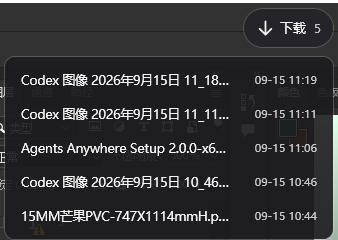
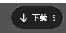

<div align="center">

# 📥 DownloadDock · 下载浮窗

**悬浮在桌面角落的下载速取胶囊 —— 悬停展开最近下载，按住直接拖进 PS/AI**

[](LICENSE)




*鼠标悬停 → 向下展开最近 5 个下载文件；按住任意一行，直接拖进 Photoshop / Illustrator*

</div>

---

## 这是什么

给"AI 生图工作流"做的桌面小工具：GPT / Codex / ComfyUI 等生成的图片默认落在**系统下载文件夹**，想让它们进 PS/AI 还得开资源管理器一层层找。DownloadDock 在桌面常驻一枚半透明胶囊按钮，**悬停即见最近 5 个文件，按住拖出去就是原生 OLE 文件拖放**——PS/AI/浏览器/聊天窗口，哪里都能丢。

纯本地运行：无网络访问、无遥测、无依赖，单文件 exe。

## ✨ 特性

- 🎯 **置顶胶囊按钮**（约 91×40）：半透明深色，不抢焦点，左键按住可拖到任意位置
- 🧠 **位置记忆**：自动保存位置，启动时校验；按钮"跑丢"可从托盘一键重置
- 📂 **悬停展开 5 行列表**：下载文件夹按修改时间从近到远，缩略图 + 文件名 + 修改日期
- 🖼️ **缩略图 + 悬浮预览**：图片文件显示行内圆角缩略图（行高不变），鼠标停在缩略图上向左弹出最长边 350px 的大图预览；非图片显示占位块
- 🖱️ **原生 OLE 拖拽**：按住文件拖进 PS/AI，和从资源管理器拖过去完全等价
- ⚡ **实时刷新**：FileSystemWatcher 监听，生成图落盘立刻出现在列表里；自动过滤 `.crdownload` / `.part` / `.tmp` 等未完成文件
- ⚙️ **托盘常驻 + 设置界面**：自定义下载文件夹（适配改过默认下载位置的人）/ 开机自启开关 / 重置按钮位置
- 📦 **绿色免安装**：单文件 exe（< 50KB），基于 .NET Framework 4.8（Windows 10/11 自带），发给别人解压即用

## 🖼️ 截图

| 收起状态 | 悬停展开 |
|:---:|:---:|
|  |  |

## 🚀 快速开始

从 [Releases](../../releases/latest) 下载 `DownloadDock-vX.X.zip`，解压后双击 `DownloadDock.exe`：

| 操作 | 效果 |
|---|---|
| 悬停悬浮按钮 | 展开 / 收起文件列表 |
| **按住某一行拖出** | 拖进 PS / AI / 任何接受文件拖放的地方 |
| 悬停在行首缩略图上 | 弹出大图预览（最长边 350px，向左弹出） |
| 左键按住悬浮按钮拖动 | 移动位置（自动记忆） |
| 双击某一行 | 用系统默认程序打开该文件 |
| 右键某一行 | 打开文件 / 打开所在文件夹 / 复制完整路径 |
| 右键悬浮按钮或托盘图标 | 设置 / 重置位置 / 打开下载文件夹 / 退出 |
| 双击托盘图标 | 打开下载文件夹 |

**设置**里可以：指定非默认的下载文件夹、"浏览..."选择、勾选**开机自启**（写入当前用户注册表 Run 项）、重置按钮位置。

数据仅存本地：`%APPDATA%\DownloadDock\`（settings.txt 位置与文件夹配置 / log.txt 日志），删除即完全卸载。

## 🛠️ 从源码构建

```powershell
git clone https://github.com/icoe44/DownloadDock.git
cd DownloadDock
pwsh -File build.ps1        # 或 Windows PowerShell: powershell -File build.ps1
```

无需安装任何 SDK——构建脚本直接调用 Windows 自带的 .NET Framework 编译器，产物：`DownloadDock.exe`（同时自动生成 `app.ico`）。

### 项目结构

```
src/
├── Program.cs          入口 + 单实例互斥
├── App.cs              全局异常 / 日志 / 自检 / 设置窗口管理
├── FloatingWindow.cs   悬浮按钮、悬停列表、拖拽、位置记忆（核心）
├── ThumbCache.cs       图片解码缓存（缩略图 / 悬浮预览共用）
├── SettingsWindow.cs   设置界面（文件夹 / 自启 / 重置）
├── StartupManager.cs   开机自启（注册表 Run）
├── DownloadsService.cs SHGetKnownFolderPath + 自定义路径 + 拖拽数据
├── SettingsStore.cs    配置持久化
└── TrayHost.cs         托盘图标
```

技术要点：WPF `AllowsTransparency` 异形置顶窗口 · `DragDrop.DoDragDrop` 原生 OLE 拖放 · `SHGetKnownFolderPath` 识别重定位的下载文件夹 · `FileSystemWatcher` 防抖刷新 · WIC 解码 + `DecodePixelWidth` 按长边封顶（downscale-only，OnLoad 不锁文件）· 悬浮预览用独立置顶穿透窗口（`WS_EX_TRANSPARENT`；WPF Popup 的自动搬移会漂位，弃用）· 旧版 csc 可编译（源码保持 C# 5 语法）。

## 🤝 贡献

Issue / PR 都欢迎。一些顺手的方向：拖拽多选（Ctrl 多选一起拖）、列表行数可调、深浅色主题自适应。

## License

[MIT](LICENSE)
